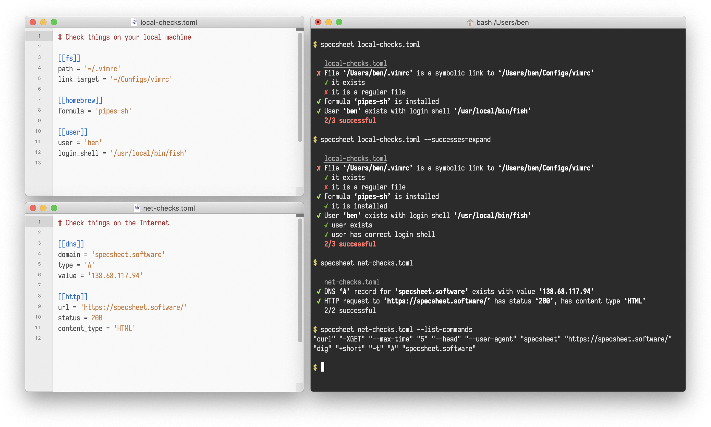

<h1>specsheet</h1>

[Specsheet](https://specsheet.software/) is the software testing toolkit.

---

Specsheet is a command-line utility that abstracts over the general testing pattern: running commands, examining their output, and collecting the results.

It can be used to test software, your computing environment, your cloud servers, and other things.

---

<a id="options">
<h1>Command-line options</h1>
</a>

### Running modes

- **-c**, **--syntax-check**: don’t run, just check the syntax of the input documents
- **-C**, **--list-commands**: don’t run, just list the commands that would be executed
- **-l**, **--list-checks**: don’t run, just list the checks that would be run
- **--list-tags**: don’t run, just list the tags defined in the input documents
- **-random-order**: run the checks in the random order
- **-continual**: run checks indefinitely
- **-delay=DURATION**: amount of time to delay between checks
- **-j**, **--threads=NUM**: number of threads to use in parallel
- **-O**, **--option=KEY=VAL**: set a global option, or override something in the environment
- **-R**, **--rewrite=THIS->THAT**: add a rule to rewrite values in input documents
- **-z**, **--analysis**: run analysis after running checks if there are errors

### Side process options

- **-x**, **--exec=CMD**: process to run in the background during execution
- **--exec-delay=DURATION**: wait an amount of time before running checks
- **--exec-port=PORT**: wait until a TCP port becomes open before running checks
- **--exec-file=FILE**: wait until a file exists before running checks
- **--exec-line=REGEX**: wait until the process outputs a string before running checks
- **--exec-kill-signal=SIGNAL**: signal to send the background process after finishing

### Filtering options

- **-t**, **--tags**: comma-separated list of tags to run
- **--skip-tags**: comma-separated list of tags to skip
- **-T**, **--types**: comma-separated list of check types to run
- **--skip-types**: comma-separated list of check types to skip

### Console output options

- **-s**, **--successes**: how to show successful results (hide, show, expand)
- **-f**, **--failures**: how to show failed results (hide, show, expand)
- **--summaries=SHOW**: when to show the summary lines (hide, show)
- **-P**, **--print**: change the output format (ansi, dots, json-lines, tap)
- **--color**, **--colour=WHEN**: when to colourise the output

### Results document options

- **--html-doc=PATH**: produce an output HTML document
- **--json-doc=PATH**: produce an output JSON document
- **--toml-doc=PATH**: produce an output TOML document

---

<a id="development">
<h1>Development

</h1></a>

Specsheet is written in [Rust](https://www.rust-lang.org/).
You will need rustc version 1.42.0 or higher.
The recommended way to install Rust for development is from the [official download page](https://www.rust-lang.org/tools/install), using rustup.

Once Rust is installed, you can compile Specsheet with Cargo:

    $ cargo build
    $ cargo test

- The [just](https://github.com/casey/just) command runner can be used to run some helpful development commands, in a manner similar to `make`.
Run `just --tasks` to get an overview of what’s available.

- If you are compiling a copy for yourself, be sure to run `cargo build --release` or `just build-release` to benefit from release-mode optimisations.
Copy the resulting binary, which will be in the `target/release` directory, into a folder in your `$PATH`.
`/usr/local/bin` is usually a good choice.

- To compile and install the manual pages, you will need [pandoc](https://pandoc.org/).
The `just man` command will compile the Markdown into manual pages, which it will place in the `target/man` directory.
To use them, copy them into a directory that `man` will read.
`/usr/local/share/man` is usually a good choice.

Specsheet is licenced under the [European Union Public Licence](https://choosealicense.com/licenses/eupl-1.2/).
